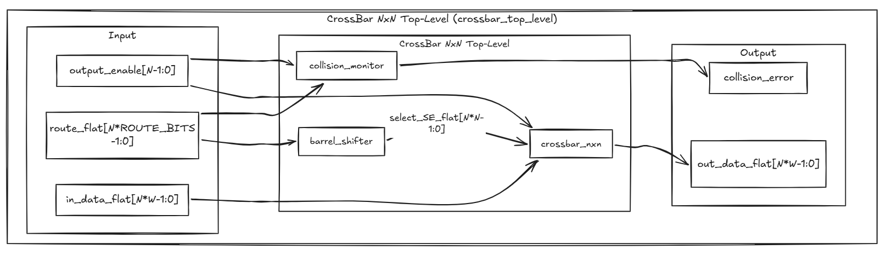

# Projeto final v0

# 1 Introdução

Este projeto apresenta a especificação, implementação em RTL (Register Transfer Level) e verificação funcional de um sistema digital de interconexão reconfigurável do tipo **Crossbar Switch NxN com gerenciamento de conflitos**, desenvolvido em **Verilog** como requisito do Trabalho Orientado I (Módulo I) do Programa CI-Digital.

O sistema proposto permite o roteamento simultâneo e independente de múltiplas portas de entrada para múltiplas portas de saída, com **parametrização do número de portas (N)** e da **largura do dado (W)**. Além da comutação dos dados, a arquitetura incorpora lógica de monitoramento para detectar condições de conflito (colisão) quando duas ou mais saídas habilitadas tentam acessar a mesma entrada no mesmo instante.

A implementação foi organizada de forma **modular e hierárquica**, separando:

- **Plano de controle** (geração de seleção one-hot a partir das rotas),
- **Plano de dados (datapath)** (comutação de dados),
- **Plano de monitoramento** (detecção de colisão).

O foco do trabalho está na **correta modelagem RTL**, na **clareza arquitetural** e na **verificação funcional**, sem abordar síntese física, otimização de área, temporização de back-end ou implementação em tecnologia específica.

# 2 Objetivo

O objetivo do projeto é desenvolver e validar um **Crossbar Switch NxN parametrizável** em Verilog, capaz de:

- Conectar qualquer entrada a qualquer saída;
- Permitir múltiplas rotas simultâneas no mesmo ciclo;
- Detectar colisões entre seleções concorrentes;
- Forçar saídas desabilitadas para zero;
- Ser reconfigurável para diferentes valores de **N** e **W** sem reescrita da lógica interna.

Além da implementação funcional, o projeto busca consolidar um fluxo de engenharia digital composto por:

```verilog
**| análise | → | especificação | → | design RTL | → | verificação funcional | → | documentação técnica |**
```

# 3 Análise de Projeto

## 3.1 Objetivo da Análise de Projeto

A análise de projeto tem como finalidade estabelecer uma base técnica clara para a concepção, implementação e verificação do sistema, garantindo coerência entre:

- os requisitos do tema proposto,
- a arquitetura adotada,
- a implementação RTL,
- e os testes realizados.

Essa etapa reduz ambiguidades, organiza decisões arquiteturais e fornece rastreabilidade entre especificação e comportamento observado na simulação.

## 3.2 Objetivos específicos da análise de projeto

- Formalizar os requisitos funcionais e estruturais do crossbar;
- Definir interfaces e sinais de controle;
- Estabelecer a arquitetura modular do sistema;
- Delimitar escopo;
- Definir critérios de verificação e aceitação;
- Garantir consistência entre diagrama, RTL e testbench.

## 3.3 Descrição Geral do Sistema

O sistema consiste em uma **interconexão digital reconfigurável NxN** capaz de rotear dados entre múltiplas portas de entrada e saída por meio de **seleção independente por saída**.

A arquitetura foi organizada em três planos:

1. **Plano de Controle**
    
    Converte os índices de rota `route[j]` em sinais de seleção `select_SE[j][i]` (one-hot por saída), por meio de um módulo denominado `barrel_shifter` (na implementação atual, usado como gerador combinacional de mapa de seleção).
    
2. **Plano de Dados (Datapath)**
    
    Realiza a comutação de `in_data` para `out_data` com base no mapa `select_SE`, e aplica a lógica de `output_enable` (saída desabilitada é forçada a zero).
    
3. **Plano de Monitoramento**
    
    Detecta colisões quando duas ou mais saídas habilitadas selecionam a mesma entrada simultaneamente, gerando a flag global `collision_error`.
    

O sistema é **puramente combinacional no RTL principal**. O clock existente no testbench é utilizado apenas para organização da amostragem dos testes.

## 3.4 Escopo do Projeto

Este projeto contempla:

- Implementação de um crossbar digital parametrizável NxN;
- Suporte a conectividade completa (qualquer entrada → qualquer saída);
- Seleção independente por saída;
- Roteamento simultâneo de múltiplas rotas;
- Geração de mapa de seleção (`select_SE`) no plano de controle;
- Detecção de colisão com flag global `collision_error`;
- Controle individual por saída (`output_enable`);
- Forçamento para zero em saídas desabilitadas;
- Testbench funcional para validação do sistema em **N=8, W>=8**.

## 3.5 Requisitos Funcionais

O sistema deve:

1. Permitir a conexão de qualquer entrada a qualquer saída;
2. Suportar múltiplas rotas distintas simultâneas;
3. Permitir seleção independente por cada saída;
4. Detectar colisão quando duas ou mais saídas habilitadas selecionarem a mesma entrada;
5. Sinalizar a colisão por meio de `collision_error`;
6. Possuir habilitação individual por saída (`output_enable[j]`);
7. Forçar `out_data[j] = 0` quando `output_enable[j] = 0`.

## 3.6 Arquitetura

A arquitetura implementada é composta pelos seguintes blocos: (**Excalidraw**: [https://excalidraw.com/#json=6uOeknHxXXK503_TV-6tO,4uRVQPezpFK6KCy5h4mJFQ](https://excalidraw.com/#json=6uOeknHxXXK503_TV-6tO,4uRVQPezpFK6KCy5h4mJFQ))


---

## 3.7.2. Plano de Controle (`barrel_shifter`)

O módulo `barrel_shifter` recebe `route_flat` (índices de rota por saída) e gera `select_SE_flat`, uma matriz flatten NxN em que cada linha representa uma saída e cada bit ativo indica qual entrada foi selecionada.

### Função implementada no código

- Extrai `route[j]` de `route_flat`;
- Converte `route[j]` em **one-hot** (`select_SE[j][i]`);
- Se `route[j]` for inválida (`route[j] >= N`), a linha é zerada.

> Na implementação atual, o módulo atua como **gerador combinacional do mapa de seleção** (plano de controle), e não como bloco de deslocamento de dados diretamente.
> 
- Módulo `barrel_shifter`
    - [x]  @Bruno Nassar
    - [x]  @Hyago Vieira

Tarefas:

- [x]  Preciso de um Testbench feito para próxima reunião (26/02)

Responsáveis:

- [x]  @Lucas Souza
- [x]  @Bruno Nassar
- [x]  @Matheus Brandani
- [x]  @Ronan

Analisem o código e me retornem modificações caso necessária, informem para mim melhorias se for necessário, comentem e adicionem em seguida desta página o testebench, juntamente com a modificação caso necessária. Vou colocar um exemplo de testebench.

---

### 3.7.3 Plano de controle (`tb_barrel_shifter`)

Serve para validar o funcionamento do deslocador de bits (barrel shifter), verificando se ele lida corretamente com diferentes padrões de entrada e se a saída está conforme o esperado.

@Lucas Souza → Feito um modelo de testbench simples que verifica a implementação do módulo barrel shifter, os valores de saída em hexadecimal devem ser: 1111 , 8421 , 1248 , 8214

@Bruno Nassar → O testbench final, verifica além dos casos padrões de rotação, usando decimal nos testes, ele demonstra o caso inválido, porém que justamente a matriz de one-hot causa, pela decodificação após o barrel shift.

- Testbench v0 usando N=4
    
    ```verilog
    // descreva aqui o Testbench simples para validar...
    `timescale 1ns/1ps
    
    module tb_barrel_shifter;
    
      parameter N = 4;
      parameter ROUTE_BITS = $clog2(N);
    
      reg  [N*ROUTE_BITS-1:0] route_flat;
      wire [N*N-1:0]          select_SE_flat;
    
      // Instancia DUT
      barrel_shifter #(
        .N(N),
        .ROUTE_BITS(ROUTE_BITS)
      ) dut (
        .route_flat(route_flat),
        .select_SE_flat(select_SE_flat)
      );
    
      initial begin
    
        // -------------------------------
        // CASO 1: Todas saídas -> entrada 0
        // route = {0,0,0,0}
        // -------------------------------
        route_flat = 8'b00000000;
        #10;
    
        // -------------------------------
        // CASO 2: Identidade
        // route[0]=0
        // route[1]=1
        // route[2]=2
        // route[3]=3
        // -------------------------------
        route_flat = {2'b11, 2'b10, 2'b01, 2'b00};
        #10;
    
        // -------------------------------
        // CASO 3: Invertido
        // route[0]=3
        // route[1]=2
        // route[2]=1
        // route[3]=0
        // -------------------------------
        route_flat = {2'b00, 2'b01, 2'b10, 2'b11};
        #10;
    
        // -------------------------------
        // CASO 4: Rota inválida
        // route[3]=4 (100 binário)
        // como ROUTE_BITS=2, 4 vira 00 (overflow)
        // então vamos simular inválido manualmente
        // -------------------------------
        route_flat = {2'b11, 2'b01, 2'b00, 2'b10};
        #10;
    
        $finish;
      end
    
    endmodule
    ```
    
    
    
- Testbench v2 usando N=8
    
    ```verilog
    `timescale 1ns / 1ps
    
    module barrel_shifter_tb();
    
    	parameter N = 8;
    	parameter ROUTE_BITS = $clog2(N);
    
    	reg [N*ROUTE_BITS-1:0] route_flat;
    	wire [N*N-1:0] select_SE_flat;
    
    	barrel_shifter #(
    		.N(N),
    		.ROUTE_BITS(ROUTE_BITS)
    	) DUT (
    		.route_flat(route_flat),
    		.select_SE_flat(select_SE_flat)
    	);
    
    	initial begin
    		$monitor("Rotas: %b_%b_%b_%b_%b_%b_%b_%b | Matriz One-Hot: %b_%b_%b_%b_%b_%b_%b_%b",
    			route_flat[23:21], route_flat[20:18], route_flat[17:15], route_flat[14:12], route_flat[11:9], route_flat[8:6], route_flat[5:3], route_flat[2:0],
    			select_SE_flat[63:56], select_SE_flat[55:48], select_SE_flat[47:40], select_SE_flat[39:32], select_SE_flat[31:24], select_SE_flat[23:16], select_SE_flat[15:8], select_SE_flat[7:0]);
    
    		// Vetor de rotas: {rota8, rota7, rota6, rota5, rota4, rota3, rota2, rota1, rota0}
    		// {7, 6, 5, 4, 3, 2, 1, 0}
    		$display("ROTA VALIDA: {7, 6, 5, 4, 3, 2, 1, 0}");
    		route_flat = {3'd7, 3'd6, 3'd5, 3'd4, 3'd3, 3'd2, 3'd1, 3'd0};
    		#10;
    
    		// {5, 4, 3, 2, 1, 0, 7, 6}
    		$display("\nROTA VALIDA: {5, 4, 3, 2, 1, 0, 7, 6}");
    		route_flat = {3'd5, 3'd4, 3'd3, 3'd2, 3'd1, 3'd0, 3'd7, 3'd6};
    		#10;
    
    		// {5, 4, 3, 2, 1, 0, 6, 7} (Rota inválida)
    		$display("\nROTA INVALIDA: {5, 4, 3, 2, 1, 0, 6, 7}");
    		route_flat = {3'd5, 3'd4, 3'd3, 3'd2, 3'd1, 3'd0, 3'd6, 3'd7};
    		#10;
    
    		// Importante:
    		// Por definição, um CROSSBAR SWITCH BARREL SHIFTER suporta apenas N combinações de mapeamentos.
    		//    Enquanto que um CROSSBAR SWITCH TRADICIONAL suporta todas as N! combinações de mapeamentos.
    		// https://en.wikipedia.org/wiki/Barrel_shifter
    	end
    
    endmodule
    
    ```
    
    
    

```verilog
module barrel_shifter #(
  parameter N = 8,
  parameter ROUTE_BITS = $clog2(N)
)(
  input  [N*ROUTE_BITS-1:0] route_flat,      // Vetor flatten com route[j] para cada saída j
  output [N*N-1:0]          select_SE_flat   // Matriz flatten de seleção: linha j ocupa [j*N +: N]
);

  // vetor one hot entrada 0 selecionada
  localparam [N-1:0] BASE_ONEHOT = {{(N-1){1'b0}}, 1'b1};

  // j percorre as saídas (cada saída possui uma rota independente)
  genvar j;
  generate
    for (j = 0; j < N; j = j + 1) begin : GEN_ROW
      // route_j = índice da entrada selecionada pela saída j
      wire [ROUTE_BITS-1:0] route_j;
      // onehot_j = vetor one-hot de tamanho N:
      // bit i = 1 indica que a entrada i deve conectar à saída j
      wire [N-1:0] onehot_j;

      // Vetores para rotação barrel (circular)
      wire [2*N-1:0] base_dup_j;
      wire [2*N-1:0] shifted_j;

      // Extrai route[j] do vetor flatten
      assign route_j = route_flat[j*ROUTE_BITS +: ROUTE_BITS];

      // Duplica o vetor base para permitir rotação circular via shift
      assign base_dup_j = {BASE_ONEHOT, BASE_ONEHOT};

      // Realiza a rotação circular do vetor base
      assign shifted_j = base_dup_j << route_j;

      // Se route_j for válido (<N), pega os N bits menos significativos
      // isso equivale a um left rotate,
      // Se invalido (quando N não é potência de 2) zera linha
      assign onehot_j = (route_j < N) ? shifted_j[N-1:0]:{N{1'b0}};

      // Escreve a linha j da matriz de seleção (select_SE[j][*]) no vetor flatten
      assign select_SE_flat[j*N +: N] = onehot_j;
    end
  endgenerate

endmodule

```

---

> **Observação**: Analisando nosso módulo e nosso teste, resumidamente, é feito inicialmente o barrel shifter, e após isso é usado o shift feito, (binarizado-one hot), para se repassado para o crossbar.
> 

---

### 3.7.4 Plano de Dados (`crossbar_nxn`)

O módulo `crossbar_nxn` realiza a comutação de dados utilizando:

- `in_data_flat`
- `select_SE_flat`
- `output_enable`

Para cada saída `j`:

- Se `output_enable[j] = 1`, o módulo seleciona a entrada correspondente ao `select_SE[j][i]`;
- Se `output_enable[j] = 0`, a saída `out_data[j]` é forçada a zero.

A implementação é combinacional e utiliza laços `for` para percorrer saídas (`j`) e entradas (`i`).

Tarefas:

- [ ]  Preciso de um Testbench feito para próxima reunião (26/02)

Responsáveis:

- @Fernando
- @Bruno Nassar
- @Bruno
- @jonesnambundo@hotmail.com

Analisem o código e me retornem modificações caso necessária, informem para mim melhorias se for necessário, comentem e adicionem em seguida desta página o testebench, juntamente com a modificação caso necessária. Vou colocar um exemplo de testebench.

---

### 3.7.5 Plano de Dados (`tb_crossbar_nxn`)

Descreva aqui o teste…

```verilog
module crossbar_nxn #(
  parameter N = 8,
  parameter W = 8
)(
  input  [N*W-1:0]     in_data_flat,     // Entradas flatten: in_data[i] ocupa [i*W +: W]
  input  [N*N-1:0]     select_SE_flat,   // Matriz de seleção flatten: linha j em [j*N +: N]
  input  [N-1:0]       output_enable,    // Habilitação por saída
  output reg [N*W-1:0] out_data_flat     // Saídas flatten: out_data[j] ocupa [j*W +: W]
);

  integer i, j;

  // tmp_out acumula o dado selecionado para a saída j
  reg [W-1:0] tmp_out;

  // sel_row representa a linha j da matriz de seleção (one-hot idealmente)
  reg [N-1:0] sel_row;

  always @* begin
    // Inicializa todas as saídas com zero
    // Isso ajuda a garantir comportamento determinístico e simplifica lógica combinacional.
    out_data_flat = {N*W{1'b0}};

    // Para cada saída j...
    for (j = 0; j < N; j = j + 1) begin
      tmp_out = {W{1'b0}};
      sel_row = select_SE_flat[j*N +: N]; // select_SE[j][*]

      // Só comuta dados se a saída estiver habilitada
      if (output_enable[j]) begin
        // Percorre todas as entradas i
        for (i = 0; i < N; i = i + 1) begin
          // Se bit i da linha de seleção estiver ativo, encaminha in_data[i] para saída j
          // Uso de OR torna o módulo robusto caso haja multi-hot acidental em sel_row
          // (em condição ideal, sel_row é one-hot e apenas uma entrada contribui).
          if (sel_row[i])
            tmp_out = tmp_out | in_data_flat[i*W +: W];
        end
      end

      // Escreve a saída j no vetor flatten
      // Se output_enable[j]=0, permanece zero (precedência de disable)
      out_data_flat[j*W +: W] = tmp_out;
    end
  end

endmodule

```

---

```verilog
// Desenvolva aqui o testbench para o módulo de crossbarnxn apenas de teste simples
```

---

### 3.7.6 Plano de Monitoramento (`collision_monitor`)

O módulo `collision_monitor` monitora `route_flat` e `output_enable` para detectar conflitos.

A lógica compara pares de saídas habilitadas (`a`, `b`) e ativa `collision_error` quando:

- `output_enable[a] == 1`
- `output_enable[b] == 1`
- `route[a] == route[b]`

Trata-se de uma lógica combinacional de comparação com complexidade O(N²), adequada ao escopo do projeto acadêmico.

- Módulo
    - [x]  @Hyago Vieira
    - [x]  @Bruno Nassar

Tarefas:

- [x]  Preciso de um Testbench feito para próxima reunião (26/02)

Responsáveis:

- [x]  @Hyago Vieira
- [x]  @Fernando
- [x]  @Luiz Fernando ribeiro
- [x]  @Carlos Miguel
- [x]  @Lucas Souza

Analisem o código e me retornem modificações caso necessária, informem para mim melhorias se for necessário, comentem e adicionem em seguida desta página o testebench, juntamente com a modificação caso necessária. Vou colocar um exemplo de testebench.

---

### 3.7.8 Plano de Monitoramento (`tb_colission_monitor`)

@Hyago Vieira → É um testbench combinacional e direto, que valida se o `colision_monitor` :

- detecta colisão quando há rotas repitidas entre saídas habilitadas
- ignora rotas repetidas quando alguma das saídas está desabilitada

@Bruno Nassar → Testbench ampliada para N=8. Exibição de resultados de colisão formatados no terminal. 

- Testbench v0 usando N=4
    
    ```verilog
    // Desenvolva o testbench aqui...
    // Testbench simples para validar collision_monitor
    `timescale 1ns/1ps
    
    module tb_collision_monitor;
    
      parameter N = 4;
      parameter ROUTE_BITS = $clog2(N);
    
      reg  [N*ROUTE_BITS-1:0] route_flat;
      reg  [N-1:0]            output_enable;
      wire                    collision_error;
    
      // Instancia DUT
      collision_monitor #(
        .N(N),
        .ROUTE_BITS(ROUTE_BITS)
      ) dut (
        .route_flat(route_flat),
        .output_enable(output_enable),
        .collision_error(collision_error)
      );
    
      initial begin
        $display("==== INICIO TESTE collision_monitor ====");
        $monitor("t=%0t | output_enable=%b | route_flat=%b | collision_error=%b",
                 $time, output_enable, route_flat, collision_error);
    
        // ------------------------------------------
        // CASO 1: Todas saídas desabilitadas
        // Mesmo com rotas iguais, NÃO deve dar colisão
        // ------------------------------------------
        route_flat     = {2'b00, 2'b00, 2'b00, 2'b00};
        output_enable  = 4'b0000;
        #10;
    
        // ------------------------------------------
        // CASO 2: Todas habilitadas, rotas diferentes (identidade)
        // route[0]=0, route[1]=1, route[2]=2, route[3]=3
        // NÃO deve dar colisão
        // ------------------------------------------
        route_flat     = {2'b11, 2'b10, 2'b01, 2'b00};
        output_enable  = 4'b1111;
        #10;
    
        // ------------------------------------------
        // CASO 3: Colisão entre duas saídas habilitadas
        // route[0]=1 e route[1]=1 -> colisão
        // ------------------------------------------
        route_flat     = {2'b11, 2'b10, 2'b01, 2'b01};
        output_enable  = 4'b1111;
        #10;
    
        // ------------------------------------------
        // CASO 4: Rotas iguais, mas uma saída desabilitada
        // route[0]=2 e route[1]=2, porém output_enable[1]=0
        // NÃO deve dar colisão
        // ------------------------------------------
        route_flat     = {2'b00, 2'b01, 2'b10, 2'b10};
        output_enable  = 4'b1101; // saída 1 desabilitada
        #10;
    
        // ------------------------------------------
        // CASO 5: Múltiplas colisões
        // route[0]=3, route[1]=3 e route[2]=0, route[3]=0
        // Deve dar colisão
        // ------------------------------------------
        route_flat     = {2'b00, 2'b00, 2'b11, 2'b11};
        output_enable  = 4'b1111;
        #10;
    
        $display("==== FIM TESTE collision_monitor ====");
        $finish;
      end
    
    endmodule
    ```
    
    
    
    
    
- Testbench v1 usando N=8
    
    ```verilog
    `timescale 1ns/1ps
    
    module tb_collision_monitor;
    
      parameter N = 8;
      parameter ROUTE_BITS = $clog2(N);
    
      reg  [N*ROUTE_BITS-1:0] route_flat;
      reg  [N-1:0]            output_enable;
      wire                    collision_error;
    
      // Instancia DUT
      collision_monitor #(
        .N(N),
        .ROUTE_BITS(ROUTE_BITS)
      ) dut (
        .route_flat(route_flat),
        .output_enable(output_enable),
        .collision_error(collision_error)
      );
    
      initial begin
        $display("==== INICIO TESTE collision_monitor ====");
        $monitor("output_enable=%b_%b | route_flat=%b_%b_%b_%b_%b_%b_%b_%b | collision_error=%b",
                 output_enable[7:4], output_enable[3:0],
    			 route_flat[23:21], route_flat[20:18], route_flat[17:15], route_flat[14:12], route_flat[11:9], route_flat[8:6], route_flat[5:3], route_flat[2:0],
    			 collision_error);
    
        // ------------------------------------------
        // CASO 1: Todas saídas desabilitadas
        // Mesmo com rotas iguais, NÃO deve dar colisão
        // ------------------------------------------
        route_flat     = {3'd0, 3'd0, 3'd0, 3'd0, 3'd0, 3'd0, 3'd0, 3'd0};
        output_enable  = 8'd0;
        #10;
    
        // ------------------------------------------
        // CASO 2: Todas habilitadas, rotas diferentes (identidade)
        // route[0]=0, route[1]=1, route[2]=2, route[3]=3, ...
        // NÃO deve dar colisão
        // ------------------------------------------
    	route_flat     = {3'd7, 3'd6, 3'd5, 3'd4, 3'd3, 3'd2, 3'd1, 3'd0};
        output_enable  = 8'b1111_1111;
        #10;
    
        // ------------------------------------------
        // CASO 3: Colisão entre duas saídas habilitadas
        // route[0]=1 e route[1]=1 -> colisão
        // ------------------------------------------
    	route_flat     = {3'd7, 3'd6, 3'd5, 3'd4, 3'd3, 3'd2, 3'd1, 3'd1};
        output_enable  = 8'b1111_1111;
        #10;
    
        // ------------------------------------------
        // CASO 4: Rotas iguais, mas uma saída desabilitada
        // route[0]=1 e route[1]=1, porém output_enable[1]=0
        // NÃO deve dar colisão
        // ------------------------------------------
        route_flat     = {3'd7, 3'd6, 3'd5, 3'd4, 3'd3, 3'd2, 3'd1, 3'd1};
        output_enable  = 8'b1111_1101; // saída 1 desabilitada
        #10;
    
        // ------------------------------------------
        // CASO 5: Múltiplas colisões
        // route[0]=3, route[1]=3 e route[2]=0, route[3]=0
        // Deve dar colisão
        // ------------------------------------------
        route_flat     = {2'b00, 2'b00, 2'b11, 2'b11};
    	route_flat     = {3'd7, 3'd6, 3'd5, 3'd4, 3'd0, 3'd0, 3'd3, 3'd3};
        output_enable  = 8'b1111_1111;
        #10;
    
        $display("==== FIM TESTE collision_monitor ====");
        $finish;
      end
    
    endmodule
    ```
    
    
    
    
    

```verilog
module collision_monitor #(
  parameter N = 8,
  parameter ROUTE_BITS = $clog2(N)
)(
  input  [N*ROUTE_BITS-1:0] route_flat,   // Rotas de todas as saídas (flatten)
  input  [N-1:0] output_enable,// Máscara de habilitação por saída
  output reg collision_error // Flag global de colisão
);

  // Índices de comparação entre pares de saídas
  integer a, b;

  // Registradores temporários para armazenar route[a] e route[b]
  reg [ROUTE_BITS-1:0] route_a, route_b;

  always @* begin
    // Valor padrão: sem colisão
    collision_error = 1'b0;

    // Compara todos os pares únicos de saídas (a,b) com b>a
    // Complexidade O(N^2),  pequeno/moderado neste projetoaceitável para N.
    for (a = 0; a < N; a = a + 1) begin
      for (b = a + 1; b < N; b = b + 1) begin
        // Extrai as rotas atuais de a e b
        route_a = route_flat[a*ROUTE_BITS +: ROUTE_BITS];
        route_b = route_flat[b*ROUTE_BITS +: ROUTE_BITS];

        // Há colisão se:
        // 1) as duas saídas estão habilitadas
        // 2) ambas selecionam a mesma entrada
        if (output_enable[a] && output_enable[b] && (route_a == route_b))
          collision_error = 1'b1;
      end
    end
  end

endmodule

```

---

> **Observação**: Analisando nosso módulo e nosso teste, resumidamente, é obtido as rotas e verifica das entradas que selecionam a mesma saída (colisão detectada) caso contrário não.
> 

---

### 3.7.7 System Top Level (`crossbar_top_level`)

O módulo `crossbar_top_level` é o **módulo principal** do sistema.

Ele junta os 3 blocos do projeto:

- `barrel_shifter` → gera a seleção (`select_SE_int_flat`)
- `crossbar_nxn` → faz a comutação dos dados
- `collision_monitor` → detecta colisão de rotas

### Entradas

- **`in_data_flat [N*W-1:0]`**
    
    Dados de entrada (flatten). Contém `N` entradas, cada uma com `W` bits.
    
- **`route_flat [N*ROUTE_BITS-1:0]`**
    
    Rotas por saída (flatten).
    
    Cada `route[j]` diz qual entrada será conectada à saída `j`.
    
- **`output_enable [N-1:0]`**
    
    Habilitação por saída.
    
    Se `output_enable[j] = 0`, a saída `j` é forçada para zero.
    

### Saídas

- **`out_data_flat [N*W-1:0]`**
    
    Dados de saída (flatten), após a comutação.
    
- **`collision_error`**
    
    Flag global de colisão (1 = existe conflito de rota entre saídas habilitadas).
    

Tarefas:

- [ ]  Preciso de um Testbench feito para próxima reunião (26/02)

Responsáveis:

- @Hyago Vieira
- @Fernando
- @Érica Silva

Analisem o código e me retornem modificações caso necessária, informem para mim melhorias se for necessário, comentem e adicionem em seguida desta página o testebench, juntamente com a modificação caso necessária. Vou colocar um exemplo de testebench.

---

### 3.7.8 System Top Level (`tb_crossbar_nxn`)

Descreva aqui o teste…

```verilog
module crossbar_top_level #(
  parameter N = 8,
  parameter W = 8,
	parameter ROUTE_BITS = $clog2(N) 
)(
  input  [N*W-1:0]          in_data_flat,     // Dados de entrada (flatten)
  input  [N*ROUTE_BITS-1:0] route_flat,       // Rotas por saída (flatten)
  input  [N-1:0]            output_enable,    // Habilitação por saída
  output [N*W-1:0]          out_data_flat,    // Dados de saída (flatten)
  output                    collision_error    // Flag global de colisão
);

  // Sinal interno: matriz de seleção gerada a partir das rotas
  // Representa select_SE[j][i] em formato flatten.
  wire [N*N-1:0] select_SE_int_flat;

  // ---------------------------------------------------------------------------
  // Plano de Controle: converte route[j] em one-hot select_SE[j][i]
  // ---------------------------------------------------------------------------
  barrel_shifter #(
    .N(N),
    .ROUTE_BITS(ROUTE_BITS)
  ) u_barrel_shifter (
    .route_flat(route_flat),
    .select_SE_flat(select_SE_int_flat)
  );

  // ---------------------------------------------------------------------------
  // Datapath: realiza a comutação NxN + aplica enable/zero por saída
  // ---------------------------------------------------------------------------
  crossbar_nxn #(
    .N(N),
    .W(W)
  ) u_crossbar_nxn (
    .in_data_flat(in_data_flat),
    .select_SE_flat(select_SE_int_flat),
    .output_enable(output_enable),
    .out_data_flat(out_data_flat)
  );

  // ---------------------------------------------------------------------------
  // Monitoramento: detecta conflito de seleção entre saídas habilitadas
  // ---------------------------------------------------------------------------
  collision_monitor #(
    .N(N),
    .ROUTE_BITS(ROUTE_BITS)
  ) u_collision_monitor (
    .route_flat(route_flat),
    .output_enable(output_enable),
    .collision_error(collision_error)
  );

endmodule

```

---

```verilog
// Desenvolva aqui o testbench...
```

---

## 3.8 Casos de teste

### Caso A - 4 rotas simultâneas (sem colisão)

Valida o roteamento paralelo com múltiplas saídas ativas e rotas distintas, comprovando ausência de interferência indevida entre barramentos.

### Caso B - Colisão forçada

Força duas saídas habilitadas a selecionarem a mesma entrada e valida a ativação de `collision_error`.

### Caso C -Habilitação/zero + colisão mascarada

Valida:

- precedência da lógica de `output_enable` (saída desabilitada zerada),
- e cenário em que rotas repetidas não geram colisão quando uma das saídas está desabilitada.

### Caso D - Mudança dinâmica de rota

Altera a rota de uma saída habilitada ao longo do tempo e observa a comutação correta no DUT.

---

## 3.9 Requisitos de Implementação (Design RTL)

A implementação RTL atende aos seguintes critérios:

- Uso de **parâmetros (`parameter`)** para `N`, `W` e `ROUTE_BITS`;
- Uso de **laços `for`** e **`generate`** para escalabilidade;
- Organização modular hierárquica;
- Lógica combinacional para seleção, comutação e monitoramento;
- Validação com instância mínima **N=8** e **W>=8** no testbench.

## 3.10 Requisitos de Verificação

- A verificação deve suportar a configuração sintetizada
- Deve ser verificado o roteamento paralelo de alta densidade, com pelo menos 4 rotas simultâneas distintas no mesmo ciclo de teste.
- Deve ser verificada a detecção de conflito quando múltiplas saídas selecionam a mesma entrada, com ativação do sinal `collision_error`.
- Deve ser verificado o comportamento das saídas sob condições de `enable`/`disable`, garantindo que o estado lógico `zero` é disciplinado com precedência absoluta para `disable`.
- Deve ser avaliado o comportamento do sistema sob mudanças dinâmicas de configuração de rotas, por meio da observação de diagramas de tempo.

### 3.11 IDE, HDL e Simulador/Sintetizador

- VScode
    - Integração rápida com GitHub
    - Contém extensões de renderização de Markdown
    - Integra CLI
- Verilog
    - IEEE 1364-2005 and 1364-1995 (Verilog)
    - Mentor ModelSim - Intel FPGA Starter Edition 2020.1 Rev. 2020.02 - feb, 28 2020

### 3.13 Estrutura de repositório

- link: https://github.com/HyAgOsK/CIDigital_Grupo_2_CrossBar_Switch_NxN

```verilog
CIDigital_Grupo_2_CrossBar_Switch_NxN/
├── .gitignore
├── README.md
├── barrel_shifter.v        
├── crossbar_nxn.v          
├── collision_monitor.v      
├── crossbar_system.v       
├── tb_barrel_shifter.v      
├── tb_crossbar_nxn.v       
├── tb_colission_monitor.v
└── tb_crossbar_system.v    
```

# 4 Conclusão

….

Este projeto apresentou o desenvolvimento de um **Crossbar Switch NxN com gerenciamento de conflitos**, implementado em Verilog com arquitetura modular e parametrizável. A solução foi estruturada em três planos, controle, datapath e monitoramento e integrada por um módulo top-level coerente com o diagrama de blocos proposto.

…
A verificação funcional por testbench demonstrou o atendimento aos cenários exigidos pelo tema, incluindo:

- [ ]  roteamento paralelo de múltiplas saídas,
- [ ]  detecção de colisão,
- [ ]  controle de habilitação com saída zerada,
- [ ]  e mudança dinâmica de rotas.

# 5 Referências bibliográficas

- **Tema 2 — Crossbar Switch NxN com Gerenciamento de Conflitos** (enunciado do projeto).
- **SD192 – Trabalho Orientado I** (orientações da disciplina / módulo).
- IEEE Std 1364 — Verilog Hardware Description Language.
- Documentação e código RTL desenvolvidos pelo grupo (módulos e testbench do projeto)

# Anexos

… simulações, testes, prints tudo que podemos adicionar a mais….
